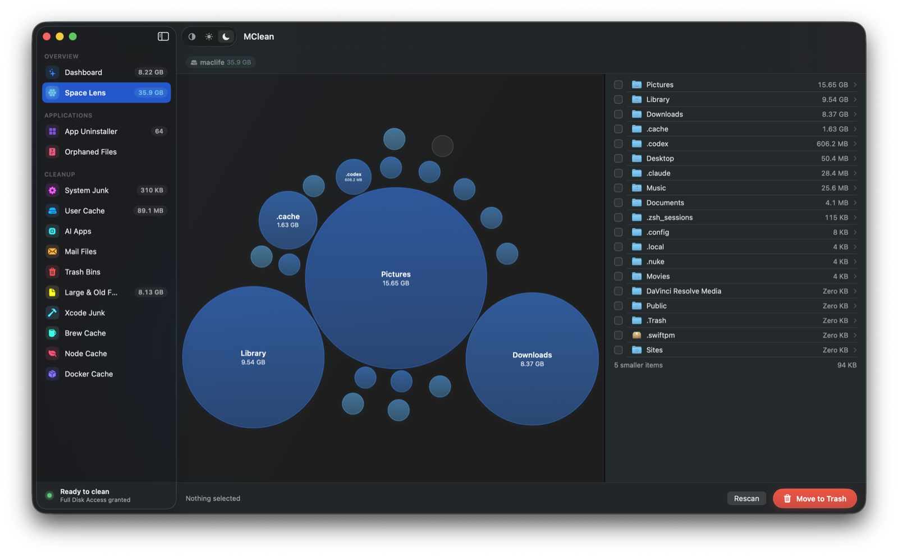
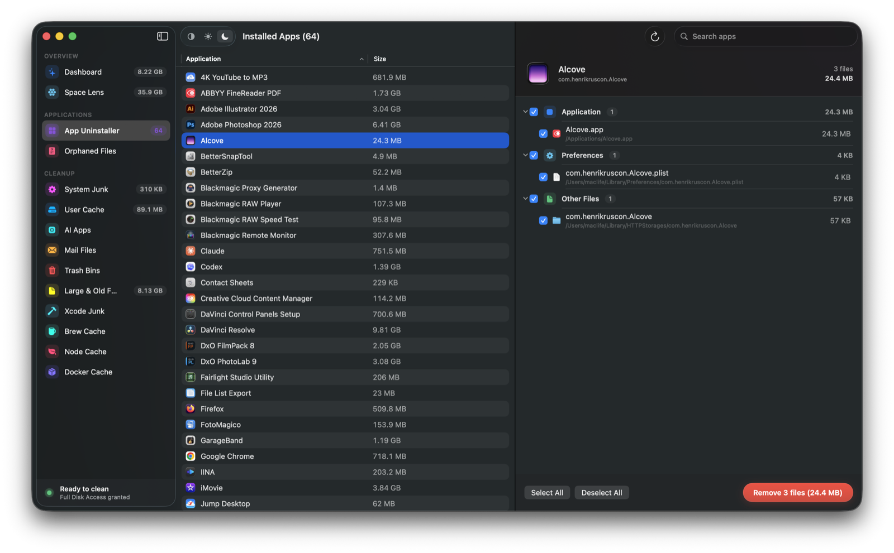

<p align="center">
  
</p>

<p align="center">
  <b>Tiếng Việt</b> |
  <a href="docs/README.en.md">English</a> |
  <a href="docs/README.ja.md">日本語</a> |
  <a href="docs/README.zh-Hans.md">简体中文</a> |
  <a href="docs/README.zh-Hant.md">繁體中文</a>
</p>

<h1 align="center">MClean</h1>

<p align="center">
  <b>Giành lại dung lượng máy Mac của bạn.</b><br>
  Dọn rác, gỡ ứng dụng tận gốc và soi ổ đĩa bằng bản đồ bong bóng — miễn phí, mã nguồn mở.<br>
  Không thuê bao. Không thu thập dữ liệu. Không hù dọa.
</p>

<p align="center">
  
  
  
  
  <a href="LICENSE"></a>
</p>

<p align="center">
  <a href="#tính-năng">Tính năng</a> ·
  <a href="#cài-đặt">Cài đặt</a> ·
  <a href="#cam-kết">Cam kết</a> ·
  <a href="#quyền-truy-cập">Quyền truy cập</a> ·
  <a href="#đóng-góp">Đóng góp</a>
</p>

---

## Tính năng

### 🧹 Quét thông minh

Một nút bấm quét **10 hạng mục song song**: rác hệ thống, cache người dùng, ứng dụng AI (Ollama, LM Studio), tệp Mail, thùng rác, tệp lớn & cũ, rác Xcode, cache Brew / Node / Docker. Kết quả hiển thị theo biểu đồ từng hạng mục — bạn tick chọn thứ muốn dọn, MClean không bao giờ tự ý xoá.

- Cache được phát hiện **động** theo ứng dụng thật trên máy, không dùng danh sách cứng
- Tệp lớn & cũ (>100 MB hoặc >1 năm) **không bao giờ được chọn sẵn**
- Dung lượng purgeable của APFS chỉ hiển thị để minh bạch — MClean **không** nhận vơ "thu hồi" thứ mà chỉ macOS kiểm soát được

### 🔍 Space Lens — soi ổ đĩa bằng bản đồ bong bóng

<p align="center">
  
</p>

Quét thư mục Nhà (hoặc bất kỳ thư mục nào) và xem toàn bộ dung lượng dưới dạng **bong bóng tỉ lệ theo byte thật**. Nhấp bong bóng để đi sâu vào từng thư mục, breadcrumb để quay ra, tick chọn ở danh sách bên phải rồi chuyển tất cả vào Thùng rác.

- Kích thước là **byte cấp phát thật**: hard link loại trùng, symlink không đi theo, tệp ẩn được tính
- Gói `.app` được coi là một mục như Finder
- Thư mục thiếu quyền đọc được **đánh dấu rõ** thay vì âm thầm tính thiếu

### 🗑 Gỡ ứng dụng tận gốc

<p align="center">
  
</p>

Chọn một ứng dụng và MClean dùng **bộ đối chiếu 10 tầng** (bundle ID, mã định danh nhóm, entitlements, metadata Spotlight, container, tên công ty, khớp đường dẫn) để lôi ra mọi thứ nó rải khắp máy: preferences, caches, containers, launch agents, logs. Xoá một lần, sạch hoàn toàn — không cần cài thêm app gỡ cài đặt nào khác.

- Ba mức độ nhạy: **Nghiêm ngặt · Nâng cao · Sâu**
- Ứng dụng hệ thống của Apple được bảo vệ, không thể gỡ nhầm
- Chuột phải app trong Finder → **Dịch vụ → Uninstall with MClean** để gỡ nhanh

### 🧩 Tìm tệp mồ côi

Duyệt `~/Library` tìm tệp của những ứng dụng **đã bị xoá từ lâu** — cache, container, preferences còn sót từ app bạn gỡ năm ngoái vẫn đang chiếm chỗ. So khớp với danh sách ứng dụng đang cài để không báo nhầm.

### ⏰ Dọn dẹp theo lịch

Tuỳ chọn chạy nền theo chu kỳ (mỗi giờ → mỗi tháng), có ngưỡng dung lượng tối thiểu để chỉ dọn khi thực sự đáng, kèm thông báo kết quả.

### Và những thứ nhỏ mà chất

- **Theo dõi hệ thống trên thanh menu**: CPU / RAM / đĩa trực tiếp, bật tắt trong Cài đặt
- **5 ngôn ngữ**: Tiếng Việt, English, 日本語, 简体中文, 繁體中文
- **Giao diện sáng / tối / theo hệ thống**, thiết kế native SwiftUI
- **Nhẹ**: cả app ~11 MB, không nhúng framework ngoài

## Cài đặt

Build từ mã nguồn — cần **Xcode 16+** và **macOS 13 trở lên**:

```bash
brew install xcodegen
git clone https://github.com/PhamHungTien/MClean.git
cd MClean
xcodegen generate
xcodebuild -project MClean.xcodeproj -scheme MClean -configuration Release \
  -derivedDataPath build build
open build/Build/Products/Release/MClean.app
```

> Bản cài sẵn (`.dmg`) sẽ có ở mục **Releases** khi phát hành phiên bản chính thức đầu tiên.

## Cam kết

Một app dọn Mac xin quyền sâu nhất macOS có (Toàn quyền Truy cập Đĩa) rồi xoá tệp của bạn — điều đó đòi hỏi niềm tin. Đây là hợp đồng MClean tự ràng buộc, kiểm chứng được từng dòng trong mã nguồn:

| Cam kết | Cụ thể |
|---|---|
| **Thùng rác, không `rm`** | Mọi thứ bị xoá đều vào Thùng rác qua `FileManager.trashItem` — xoá nhầm thì kéo lại |
| **Không thu thập dữ liệu** | Không analytics, không crash report, không gọi mạng về chúng tôi |
| **Không hù dọa** | Không "máy bạn đang gặp nguy!", không bộ đếm đỏ giả tạo — chỉ số liệu trung tính |
| **Bạn duyệt trước khi xoá** | Không có gì tự động; mỗi mục hiện đường dẫn thật kèm Hiện-trong-Finder |
| **Kiểm tra được** | MIT — mã quyết định xoá gì nằm ở [`MClean/Services`](MClean/Services) và [`MClean/Logic/Scanning`](MClean/Logic/Scanning) |

Nếu một ngày MClean thêm telemetry, khoá tính năng sau tường phí hay quét kiểu hù dọa — nó đã trở thành thứ nó sinh ra để thay thế. Hãy bắt chúng tôi giữ lời.

## Quyền truy cập

MClean cần **Toàn quyền Truy cập Đĩa** để đọc những nơi macOS ẩn khỏi mọi ứng dụng (tệp Mail, dữ liệu Safari, container được bảo vệ). Thiếu quyền này việc dọn bỏ sót ~70%. Màn hình đầu tiên hướng dẫn cấp quyền từng bước; nếu thao tác nào thất bại vì quyền, MClean tự mở Cài đặt, theo dõi và **tự thử lại đúng phần bị lỗi** ngay khi bạn cấp — không phải chọn lại gì.

MClean **không**: thu thập dữ liệu · cần mạng để hoạt động · chuyển tệp đi đâu ngoài Thùng rác.

## Bảo mật

- Chống tấn công symlink: phân giải đường dẫn trước khi kiểm tra, phân giải lại ngay trước khi xoá (đóng khe TOCTOU)
- Danh sách cho phép: đường dẫn ngoài vùng an toàn bị từ chối xoá
- Ứng dụng hệ thống Apple không thể gỡ trong mọi trường hợp
- Mọi thao tác xoá yêu cầu xác nhận rõ ràng theo mặc định

Phát hiện lỗ hổng? Vui lòng mở **security advisory riêng tư** thay vì issue công khai.

## Đóng góp

Hoan nghênh pull request — xem [CONTRIBUTING.md](CONTRIBUTING.md). Đặc biệt mong:
- Bộ lọc kích thước/ngày theo hạng mục
- Mở rộng test cho `AppState` và bộ máy quét
- Thêm ngôn ngữ (hiện có: vi, en, ja, zh-Hans, zh-Hant)

## Giấy phép

MIT — xem [LICENSE](LICENSE). Dùng, fork, phát hành dưới tên bạn nếu muốn; điều duy nhất giấy phép yêu cầu là giữ lại thông báo bản quyền.
