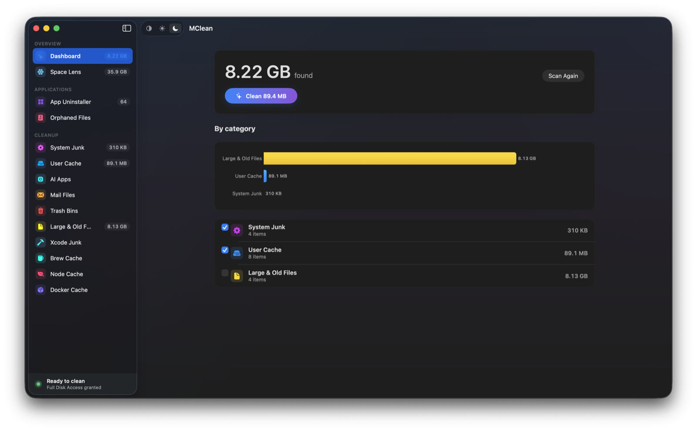

<p align="center">
  
</p>

<p align="center">
  <a href="../README.md">Tiếng Việt</a> |
  <b>English</b> |
  <a href="README.ar.md">العربية</a> |
  <a href="README.es.md">Español</a> |
  <a href="README.ja.md">日本語</a> |
  <a href="README.zh-Hans.md">简体中文</a> |
  <a href="README.zh-Hant.md">繁體中文</a>
</p>

<h1 align="center">MClean</h1>

<p align="center">
  <b>Reclaim your Mac.</b><br>
  Free, open-source uninstaller and cleaner for macOS. No subscription, no telemetry, no upsell.
</p>

<p align="center">
  
  
  <a href="../LICENSE"></a>
</p>

---

## Install

Build from source (Xcode 16+, macOS 13+):

```bash
brew install xcodegen
git clone https://github.com/maclifevn/MClean.git
cd MClean
xcodegen generate
xcodebuild -project MClean.xcodeproj -scheme MClean -configuration Release \
  -derivedDataPath build build
open build/Build/Products/Release/MClean.app
```

A pre-built `.dmg` will be published under **Releases** when the first version ships.

## Why this exists

Apple sells base-model Macs with 256 GB SSDs that you can't upgrade. Once you've paid for that storage, every gigabyte matters — and most Mac cleaners are subscription apps that hide disk usage behind a paywall, ship telemetry, and trade on FUD ("47 GB of junk detected!"). MClean is the opposite: one-time, no telemetry, open source, honest scans, real uninstalls.

## What it does

### App Uninstaller
Discovers everything in `/Applications` and `~/Applications`, then uses a 10-level matching engine (bundle ID, team identifier, entitlements, Spotlight metadata, container discovery, company-name heuristics, partial path matches) to find every file the app dropped. Three sensitivity tiers — Strict, Enhanced, Deep. Apple system apps are excluded automatically. You can also right-click any app in Finder → **Services → Uninstall with MClean**.

### Orphan Finder
Walks `~/Library` and surfaces files left behind by apps that no longer exist on disk.

### System Cleaner
Smart Scan runs every category in parallel: System Junk, User Cache, AI Apps, Mail Files, Trash Bins, Large & Old Files, Xcode Junk, Brew Cache, Node Cache, Docker Cache.

### Space Lens
Scan any folder and see its contents as an interactive bubble map — every bubble sized proportionally to the bytes it holds. Drill into folders, then check items to move them to the Trash. Sizes are real allocated bytes: hard links deduplicated, symlinks never followed, app bundles treated as single items.

### Scheduled Cleaning
Optional. Configurable interval with an auto-clean threshold.

## Our promise

- **Trash, never `rm`.** Everything goes to the Trash via `FileManager.trashItem`.
- **No telemetry, ever.** No analytics, no crash reporting, no network calls to us.
- **No fake urgency.** Neutral facts, no fear-based scans.
- **You review before anything is removed.** Every item shows its real path.
- **Auditable.** It's MIT. Read the code, fork it, ship your own.

## Permissions

MClean needs **Full Disk Access** to read locations macOS hides from every app by default — Mail downloads, Safari data, the TCC database, protected app containers. Without it, cleanup misses roughly 70% of what it could find. First-launch onboarding walks you through granting it. MClean collects no telemetry, needs no network connection, and moves data nowhere except the Trash.

## Security

- Symlink attack prevention: paths resolved before validation, re-resolved immediately before unlink (closes TOCTOU windows).
- Allow-list cleaning: a path outside an explicit safe-root is refused.
- System app protection: Apple's bundles cannot be uninstalled.
- All destructive operations require explicit confirmation by default.

If you find a vulnerability, please open a private security advisory rather than a public issue.

## Contributing

Pull requests welcome. See [CONTRIBUTING.md](../CONTRIBUTING.md).

## License

MIT. See [LICENSE](../LICENSE).
